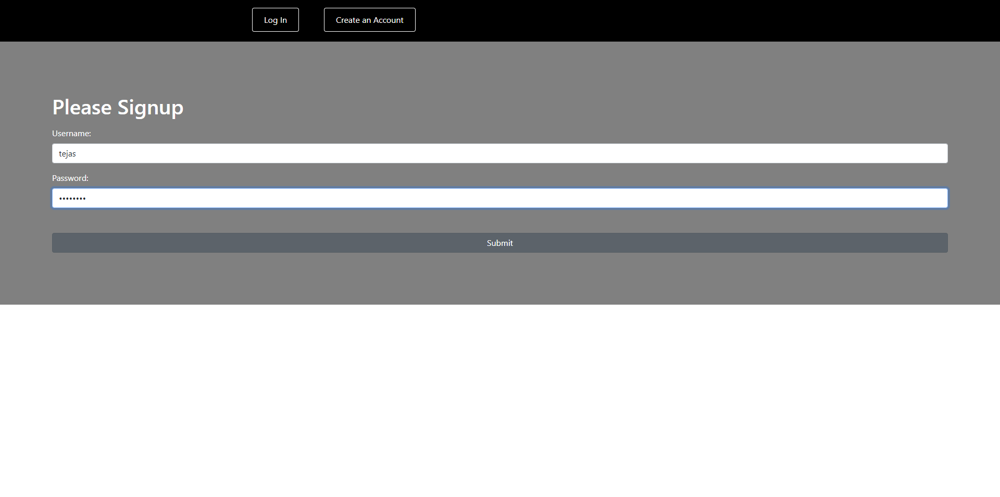
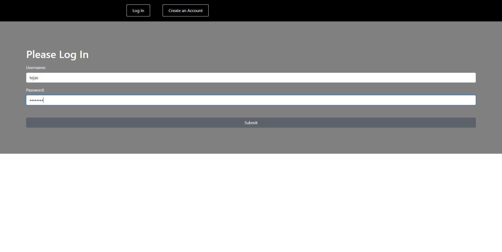
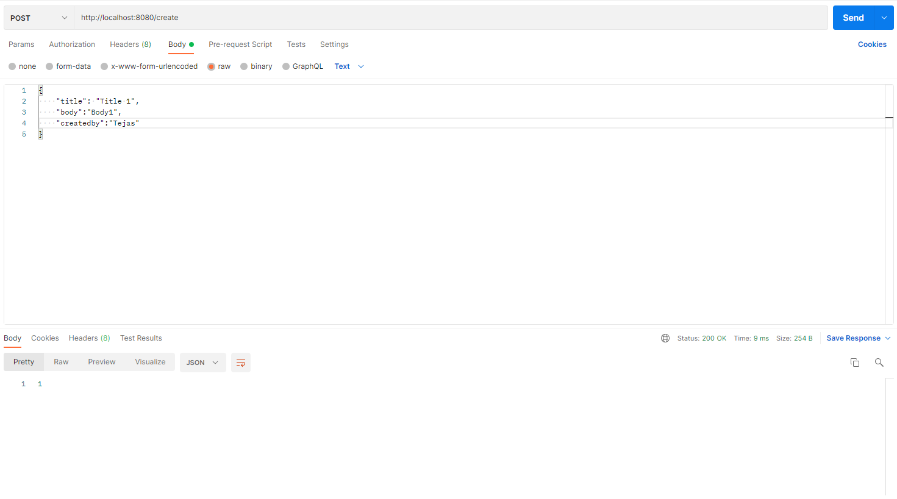
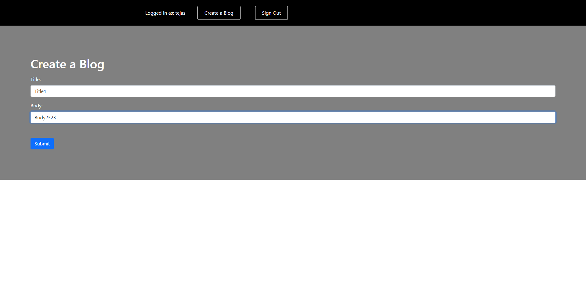
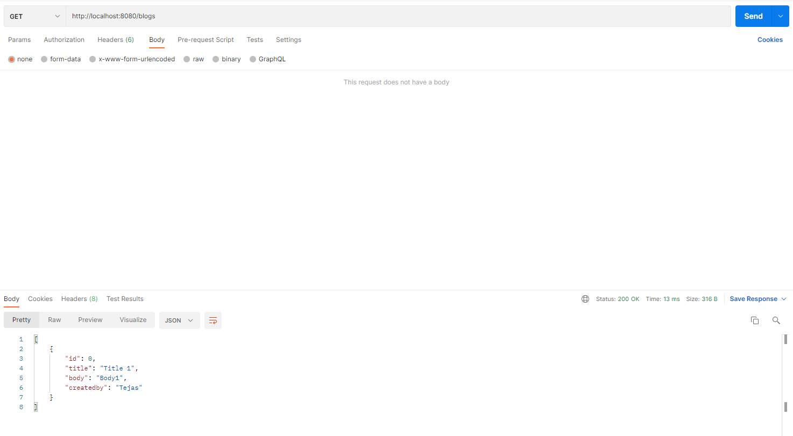
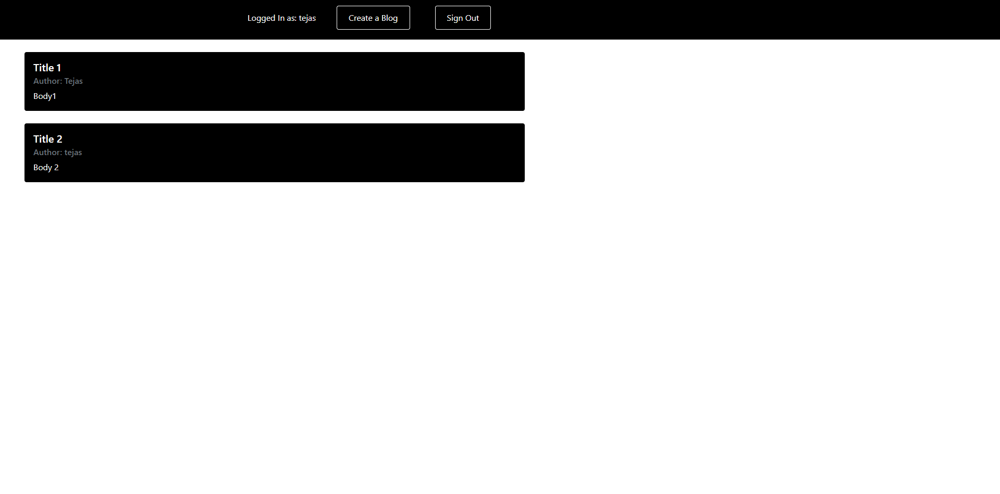

# SpringBoot React Webapp

### Run Spring Boot Server by Running Demo Applicaiton.java file

### Run React app using 
`npm start`
Open [http://localhost:3000](http://localhost:3000) to view it in your browser.

## Output Images:

### Register User
http://localhost:8080/signup

### Login User
http://localhost:8080/login

### Create Blogs
http://localhost:8080/create

### Display Blogs
http://localhost:8080/blogs

